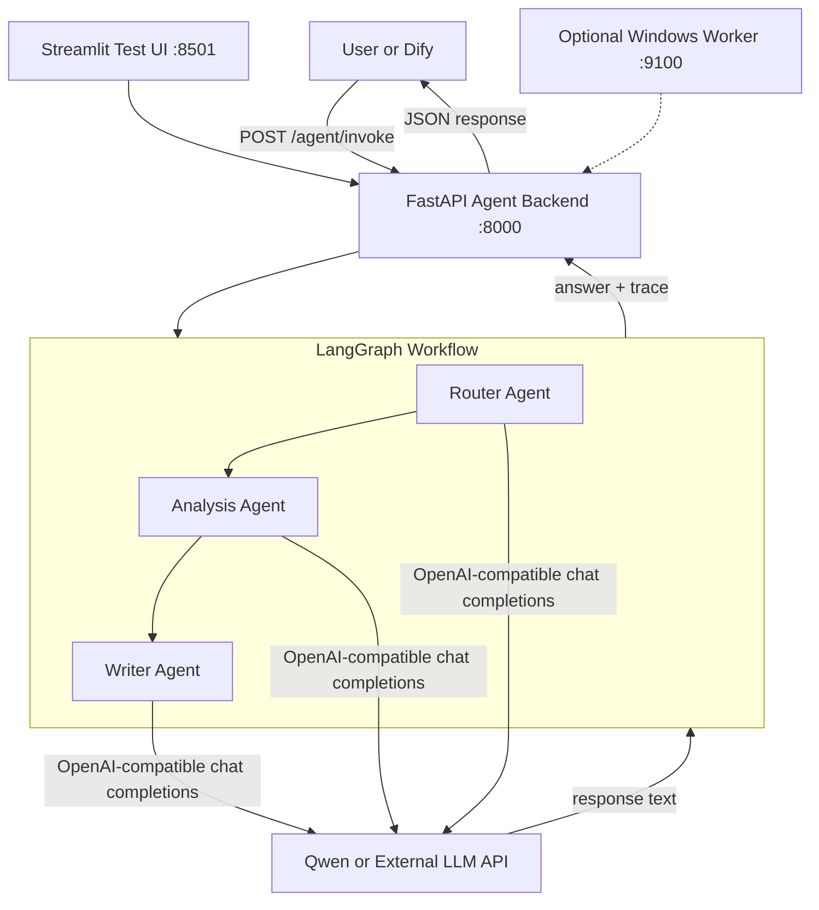

# Dify + LangGraph + Qwen Agent Backend

This project is a local multi-agent backend for Dify-style enterprise workflows. It exposes a FastAPI endpoint, runs a LangGraph workflow, and calls an OpenAI-compatible LLM provider such as a self-hosted Qwen server.

The default setup is designed for a local Transformers Qwen server running on port `8001`, a FastAPI agent backend on port `8000`, and an optional Streamlit test UI on port `8501`.

## What It Does

- Accepts user questions through `POST /agent/invoke`.
- Routes each question into one task type:
  - `quality_analysis`
  - `document_qa`
  - `general_chat`
- Runs a three-step LangGraph workflow:
  - Router agent
  - Analysis agent
  - Writer agent
- Returns a structured JSON response that Dify, Streamlit, or another client can display.
- Supports per-request LLM provider overrides through the request `context`.
- Includes an optional Windows worker for sandboxed local tools.

## Architecture



## Repository Layout

```text
app/
  main.py                  FastAPI app and API endpoints
  config.py                Environment settings
  qwen_client.py           OpenAI-compatible LLM client
  graph/                   LangGraph state, nodes, workflow
  prompts/                 Router, analysis, and writer prompts
  tools/                   Optional worker client

qwen_server_transformers/  Local Transformers Qwen API server
qwen_server/               vLLM-oriented Qwen helper scripts
web_ui/                    Streamlit test UI
windows_worker/            Optional sandboxed Windows worker service
scripts/                   API test scripts and curl examples
docs/                      Additional guides
```

## Prerequisites

- Python 3.10+.
- For local Qwen: an NVIDIA GPU with working CUDA/PyTorch.
- Local model files for the default setup:
  - `/data/models/Qwen2.5-7B-Instruct`
  - The directory must contain `config.json`.
- Optional: Dify if you want to call this backend from a Dify HTTP Request node.

## Configuration

Configure your runtime parameters directly in the `.env` file at the root of the repository:

```env
HOST=0.0.0.0
PORT=8000
DEBUG=true

QWEN_BASE_URL=http://127.0.0.1:8001/v1
QWEN_MODEL=qwen7b
QWEN_API_KEY=EMPTY
QWEN_TEMPERATURE=0.2
QWEN_MAX_TOKENS=2048
LLM_REQUEST_TIMEOUT_SECONDS=300

# Default LLM Provider Settings
DEFAULT_LLM_PROVIDER=local_qwen

# Windows Agent Worker Settings
ENABLE_WINDOWS_WORKER=false
WINDOWS_WORKER_BASE_URL=http://127.0.0.1:9100

# Local Qwen serving parameters
QWEN_MODEL_PATH=/data/models/Qwen2.5-7B-Instruct
QWEN_SERVED_MODEL_NAME=qwen7b
QWEN_HOST=0.0.0.0
QWEN_PORT=8001
QWEN_DEVICE=cuda
QWEN_DTYPE=auto
QWEN_MAX_NEW_TOKENS=2048
QWEN_TOP_P=0.8
QWEN_REPETITION_PENALTY=1.05
```

Important timeout settings:

- `LLM_REQUEST_TIMEOUT_SECONDS`: backend timeout for each model API call.
- `AGENT_TEST_TIMEOUT_SECONDS`: optional shell variable used by `scripts/test_agent.py`.

The integrated agent workflow makes three LLM calls. Local Transformers inference can take longer than 30 seconds, so the test script defaults to 120 seconds.

## Installation

Install backend dependencies:

```bash
pip install -r requirements.txt
```

If you use the local Transformers Qwen server, also install:

```bash
pip install -r qwen_server_transformers/requirements_transformers.txt
```

If you use the Streamlit UI, also install:

```bash
pip install -r web_ui/requirements_web.txt
```

## Quick Start

Use separate terminals for the model server, backend, and optional UI.

### 1. Start Local Qwen

```bash
bash qwen_server_transformers/start_qwen_transformers.sh
```

Expected result:

- Model loads successfully.
- Uvicorn listens on `http://0.0.0.0:8001`.
- OpenAI-compatible routes are available under `/v1`.

### 2. Test Local Qwen

In a second terminal:

```bash
python qwen_server_transformers/test_transformers_qwen_api.py
```

This checks:

- `GET /v1/models`
- `POST /v1/chat/completions`

### 3. Start the Agent Backend

In another terminal:

```bash
uvicorn app.main:app --host 0.0.0.0 --port 8000 --reload
```

The backend exposes:

- `GET /health`
- `GET /health/llm`
- `POST /llm/test`
- `POST /agent/invoke`

### 4. Test the Full Agent Workflow

```bash
python scripts/test_agent.py
```

The script calls:

```text
http://127.0.0.1:8000/agent/invoke
```

Override the client timeout if your local inference is slower:

```bash
AGENT_TEST_TIMEOUT_SECONDS=300 python scripts/test_agent.py
```

PowerShell:

```powershell
$env:AGENT_TEST_TIMEOUT_SECONDS="300"
python scripts/test_agent.py
```

Override the target API URL:

```bash
AGENT_API_URL=http://127.0.0.1:8000/agent/invoke python scripts/test_agent.py
```

### 5. Start the Web UI

```bash
bash web_ui/start_web_ui.sh
```

Open:

```text
http://<SERVER_IP>:8501
```

For private remote access, use SSH forwarding from your laptop:

```bash
ssh -L 8501:127.0.0.1:8501 user@<SERVER_IP>
```

Then open:

```text
http://127.0.0.1:8501
```

## API Usage

### Health Check

```bash
curl http://127.0.0.1:8000/health
```

### Invoke Agent

```bash
curl -X POST http://127.0.0.1:8000/agent/invoke -H "Content-Type: application/json" -d "{\"query\": \"A batch of machined parts has an outer diameter deviation of +0.05mm. The machine is CNC-01, the material is 45 steel, and the cutting tool was recently replaced. Please analyze possible causes and provide troubleshooting steps.\", \"user_id\": \"demo_user\", \"context\": {}}"
```

Response shape:

```json
{
  "answer": "Final structured answer...",
  "task_type": "quality_analysis",
  "agent_trace": [
    {
      "agent": "router",
      "input": "...",
      "output": "..."
    }
  ],
  "need_human_review": true,
  "error": null
}
```

## Dynamic LLM Provider Overrides

You can override the model provider per request by sending values in `context`.

```json
{
  "query": "Explain the maintenance schedule for CNC-01.",
  "user_id": "demo_user",
  "context": {
    "llm_provider": "local_qwen",
    "llm_base_url": "http://127.0.0.1:8001/v1",
    "llm_model": "qwen7b",
    "llm_api_key": "EMPTY",
    "llm_temperature": 0.2,
    "llm_max_tokens": 2048
  }
}
```

Supported provider labels in the current backend:

- `local_qwen`
- `minimax`

## Dify Integration

Create a Dify Chatflow or Workflow and add an HTTP Request node.

HTTP Request node settings:

- Method: `POST`
- URL:
  - Same host: `http://127.0.0.1:8000/agent/invoke`
  - Docker Dify to host backend: `http://host.docker.internal:8000/agent/invoke`
  - Remote server: `http://<SERVER_IP>:8000/agent/invoke`
- Header: `Content-Type: application/json`
- Body type: JSON

Body:

```json
{
  "query": "{{sys.query}}",
  "user_id": "{{sys.user_id}}",
  "context": {}
}
```

Display the result with:

```text
{{http_request.body.answer}}
```

Recommended Dify timeout:

- Use at least 120 seconds for local Qwen.
- Use 300 seconds if the quality-analysis prompt generates long reports.

## Streamlit Test UI

The Streamlit UI is a debugging client for the backend.

Start it with:

```bash
bash web_ui/start_web_ui.sh
```

Features:

- Sends prompts to `POST /agent/invoke`.
- Shows final answer, task type, human-review flag, and agent trace.
- Lets you switch between local Qwen and MiniMax (default multimodal `MiniMax-M2.7-highspeed`).
- Supports uploading input images for vision analysis.
- Supports inline rendering of output images (such as worker screenshots).
- Includes a model connection test button.

See [web_ui/README.md](web_ui/README.md) for more detail.

## Local Qwen Serving Options

### Transformers Server

Recommended for compatibility and MVP testing:

```bash
bash qwen_server_transformers/start_qwen_transformers.sh
```

The server implements a small OpenAI-compatible API:

- `GET /v1/models`
- `POST /v1/chat/completions`

See [qwen_server_transformers/README.md](qwen_server_transformers/README.md).

### vLLM Server

Use vLLM when you want higher throughput and your CUDA/PyTorch/vLLM stack is stable:

```bash
python -m vllm.entrypoints.openai.api_server \
  --model data/models/Qwen2.5-14B-Instruct-AWQ \
  --host 0.0.0.0 \
  --port 8001 \
  --served-model-name qwen14b \
  --gpu-memory-utilization 0.90 \
  --max-model-len 4096
```

Then update `.env`:

```env
QWEN_BASE_URL=http://127.0.0.1:8001/v1
QWEN_MODEL=qwen14b
QWEN_API_KEY=EMPTY
```

See [qwen_server/README.md](qwen_server/README.md).

## Docker Compose

The included compose file starts the FastAPI backend:

```bash
docker-compose up --build -d
```

By default, the Qwen server section is commented out. If you want to run vLLM through Docker Compose, edit `docker-compose.yml`, enable the `qwen-server` service, and make sure NVIDIA Container Toolkit is installed on the host.

## Optional Windows Worker

The Windows worker is a separate sandboxed service for local machine actions such as file reads/writes, screenshots, browser opening, and optional PowerShell execution.

Start it on Windows:

```powershell
powershell -ExecutionPolicy Bypass -File windows_worker\start_worker.ps1
```

Enable backend proxying in `.env`:

```env
ENABLE_WINDOWS_WORKER=true
WINDOWS_WORKER_BASE_URL=http://127.0.0.1:9100
```

Then restart the FastAPI backend.

Read the full guide: [docs/windows_worker_guide.md](docs/windows_worker_guide.md).

## Troubleshooting

### `scripts/test_agent.py` returns `Read timed out`

This usually means the client gave up before the full LangGraph workflow finished. The workflow makes three sequential LLM calls, and local Transformers inference can be slow.

Fix:

```bash
AGENT_TEST_TIMEOUT_SECONDS=300 python scripts/test_agent.py
```

Also check the FastAPI logs. If you see `Workflow completed successfully`, the backend and model are working.

### Qwen server starts, but `/agent/invoke` fails

Check:

```bash
python qwen_server_transformers/test_transformers_qwen_api.py
curl http://127.0.0.1:8000/health/llm
```

Make sure `.env` uses the same model name served by Qwen:

```env
QWEN_MODEL=qwen7b
QWEN_SERVED_MODEL_NAME=qwen7b
```

### Backend cannot connect to Qwen

Use `127.0.0.1` when Qwen and FastAPI run on the same machine:

```env
QWEN_BASE_URL=http://127.0.0.1:8001/v1
```

If either service runs in Docker, verify container networking and host names. Docker-to-host access may require `host.docker.internal` depending on the platform.

### CUDA or model loading fails

Check:

- `QWEN_MODEL_PATH` points to the real local model directory.
- `config.json` exists in the model directory.
- PyTorch can see CUDA.
- The installed `torch`, `transformers`, and GPU driver versions are compatible.

### Web UI cannot reach backend

Check the API URL shown by `web_ui/start_web_ui.sh`:

```bash
AGENT_API_URL=http://127.0.0.1:8000/agent/invoke bash web_ui/start_web_ui.sh
```

For remote access, prefer SSH forwarding instead of exposing Streamlit publicly.

## Current Limitations

- Document QA does not yet perform real retrieval from a vector database or document store.
- The LangGraph workflow is currently linear: router to analysis to writer.
- The backend has no built-in authentication.
- No persistent chat memory or database-backed checkpointing is configured.
- The Transformers Qwen server is intended for compatibility, not high-throughput production inference.

## Production Notes

Before using this in production, add:

- Authentication and authorization for the FastAPI backend.
- Proper secret storage for external provider API keys.
- Observability with request IDs, structured logs, and trace storage.
- Real RAG for `document_qa`.
- LangGraph checkpointing for persistent state.
- Rate limits and concurrency controls around local model inference.
- A production-grade model server such as vLLM, TGI, or a managed OpenAI-compatible endpoint.
