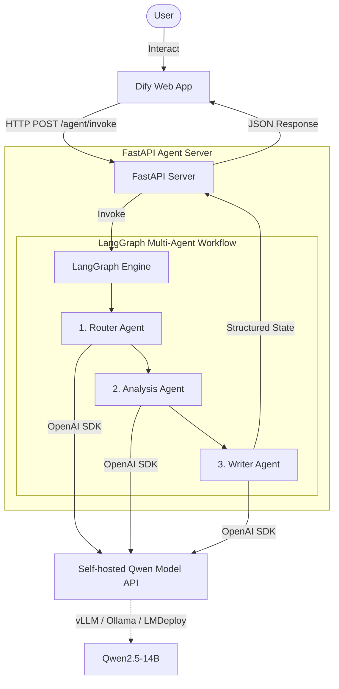

# Dify + LangGraph + self-hosted Qwen Multi-Agent MVP

This repository contains a Minimum Viable Product (MVP) system demonstrating a local enterprise-grade AI architecture using **Dify** for the frontend orchestrator, **LangGraph** for structured multi-agent logic, and a self-hosted **Qwen** model for local inference.

---

## 1. System Architecture

The workflow routes user queries dynamically, performs domain-specific reasoning, and generates structured report formats suited for industrial operations:



### Component Breakdown
1. **Dify**: Serves as the user interface and main chatbot orchestrator. Uses an **HTTP Request** node to offload agentic workflows.
2. **FastAPI Agent Server**: Exposes the REST API endpoint and translates payloads to and from LangGraph states.
3. **LangGraph Workflow**: Implements a typed state machine with:
   - **Router Node**: Classifies queries into categories (`quality_analysis`, `document_qa`, `general_chat`).
   - **Analysis Node**: Conducts domain reasoning (manufacturing expert logic, fallback QA, etc.).
   - **Writer Node**: Formats the raw analysis into standard industrial markdown templates.
4. **Qwen Model API**: An OpenAI-compatible API endpoint (e.g., via vLLM or Ollama) hosting Qwen-series models.

---

## 2. Prerequisites & Qwen Model Serving

Before starting the FastAPI backend, you must host your Qwen model. Make sure it is exposed via an OpenAI-compatible endpoint.

### Options to Serve Qwen locally (RTX 4090 24GB recommended)

#### Option A: vLLM (Recommended for performance)
Run vLLM to serve `Qwen2.5-14B-Instruct-AWQ` (fits comfortably on a single RTX 4090):
```bash
python -m vllm.entrypoints.openai.api_server \
    --model Qwen/Qwen2.5-14B-Instruct-AWQ \
    --port 8001 \
    --served-model-name qwen14b \
    --gpu-memory-utilization 0.90 \
    --max-model-len 4096
```

#### Option B: Ollama (Recommended for simplicity)
Download and start Ollama, then run the model:
```bash
ollama run qwen2.5:14b
# This will run Ollama on http://localhost:11434 by default.
# Update QWEN_BASE_URL to http://localhost:11434/v1 and QWEN_MODEL to qwen2.5:14b in your .env
```

---

## 2.5 Self-hosted Qwen model server

A dedicated deployment module for the self-hosted Qwen model is available in the `qwen_server/` folder. It provides pre-configured shell scripts to perform environment checks and run vLLM via local Python or Docker.

### Expected Execution Sequence

To deploy and test the entire system, execute commands in the following order:

#### Step 1: Run Environment Diagnostics
Verify GPU drivers, memory, disk space, and Docker GPU compatibility:
```bash
bash qwen_server/check_gpu.sh
```

#### Step 2: Start the Qwen Model Server
Choose **one** of the following options depending on your environment preference:

* **Option A (Local Python / vLLM)**:
  ```bash
  bash qwen_server/start_qwen_vllm.sh
  ```
* **Option B (Docker / vLLM Container)**:
  ```bash
  bash qwen_server/start_qwen_vllm_docker.sh
  ```

#### Step 3: Test Qwen API Connectivity
Verify that Qwen is correctly serving an OpenAI-compatible chat completion endpoint:
```bash
python qwen_server/test_qwen_api.py
```

#### Step 4: Start the FastAPI LangGraph Backend
Start the agent application server (runs on port `8000` by default):
```bash
uvicorn app.main:app --host 0.0.0.0 --port 8000 --reload
```

#### Step 5: Test the Integrated /agent/invoke Flow
Query the FastAPI backend to trigger the multi-agent reasoning graph:
```bash
python scripts/test_agent.py
```

---


## 3. Configuration

1. Copy the example environment file:
   ```bash
   cp .env.example .env
   ```
2. Open `.env` and adjust the variables based on your setup:
   ```env
   # Server Configuration
   HOST=0.0.0.0
   PORT=8000
   DEBUG=true

   # Qwen OpenAI-compatible API Configurations
   QWEN_BASE_URL=http://localhost:8001/v1
   QWEN_API_KEY=EMPTY
   QWEN_MODEL=qwen14b
   QWEN_TEMPERATURE=0.2
   QWEN_MAX_TOKENS=2048
   ```

---

## 4. How to Run

### Method A: Local Python Environment

1. Create a virtual environment and activate it:
   ```bash
   python -m venv venv
   # On Windows:
   venv\Scripts\activate
   # On Linux/macOS:
   source venv/bin/activate
   ```
2. Install dependencies:
   ```bash
   pip install -r requirements.txt
   ```
3. Run the FastAPI application:
   ```bash
   uvicorn app.main:app --host 0.0.0.0 --port 8000 --reload
   ```

### Method B: Docker Compose

Build and launch the backend using Docker Compose:
```bash
docker-compose up --build -d
```
The server will start on port `8000`.

---

## 5. Testing the API

Verify the server is running by triggering a test.

### Option A: Testing Script (Recommended)
Run the pre-configured Python test script:
```bash
python scripts/test_agent.py
```

### Option B: curl Command
Run a curl command from your terminal:
```bash
curl -X POST http://localhost:8000/agent/invoke \
  -H "Content-Type: application/json" \
  -d '{
    "query": "A batch of machined parts has an outer diameter deviation of +0.05mm. The machine is CNC-01, the material is 45 steel, and the cutting tool was recently replaced. Please analyze possible causes and provide troubleshooting steps.",
    "user_id": "demo_user",
    "context": {}
  }'
```

---

## 6. Integrating with Dify

To connect this backend to a Dify Application:

### 1. In Dify Studio
1. Create a new **Chatflow** or **Workflow** application.
2. Add an **HTTP Request** node between your Start node and the End response node.

### 2. Configure HTTP Request Node
* **Method**: `POST`
* **URL**:
  * If Dify is running in a local Docker container: `http://host.docker.internal:8000/agent/invoke`
  * If Dify is running on another machine/VM: `http://<SERVER_IP>:8000/agent/invoke`
* **Headers**:
  * Key: `Content-Type`, Value: `application/json`
* **Body Type**: `JSON`
* **Body Key-Values**:
  ```json
  {
    "query": "{{sys.query}}",
    "user_id": "{{sys.user_id}}",
    "context": {}
  }
  ```

### 3. Parse and Display the Response
Bind the response from the HTTP request node in Dify to your UI. Dify will expect the following schema:

```json
{
  "answer": "Final enterprise-style analysis report...",
  "task_type": "quality_analysis",
  "agent_trace": [
    {
      "agent": "router",
      "input": "...",
      "output": "..."
    },
    ...
  ],
  "need_human_review": true
}
```

In Dify, you can output `{{http_request.body.answer}}` directly to the user as the assistant's message.

---

## 7. Known Limitations of this MVP

- **No RAG**: Document QA currently responds with placeholder flows rather than embedding/retrieving real database documents.
- **No Database Persistence**: Run-states exist entirely in-memory during request processing; no chat history is saved to PostgreSQL/Redis.
- **Simple Flow**: The current graph is a linear chain. It does not contain cycles, loops, or complex conditional branches.
- **No Authentication**: The API endpoint is open for local simplicity and lacks API key verification.

---

## 8. Next Steps for Production

To scale this MVP to a production enterprise deployment, consider:
1. **Real RAG integration**: Connect Langchain/LlamaIndex vector store tools inside the `document_qa` path.
2. **Database Persistence**: Use LangGraph's `SqliteSaver` or `PostgresSaver` checkpointing to support persistent chat memory and multi-turn conversations.
3. **Enterprise Connectors**: Integrate tools for querying relational databases (e.g., ERP, MES systems) to get live CNC logs or part dimensions.
4. **Human-in-the-loop (HITL)**: Utilize LangGraph interrupts when `need_human_review` is `true`, pausing the graph state until an engineer approves it via Dify or an external admin portal.
5. **Observability**: Integrate tools like LangSmith, Langfuse, or Phoenix for trace logging and latency monitoring.
